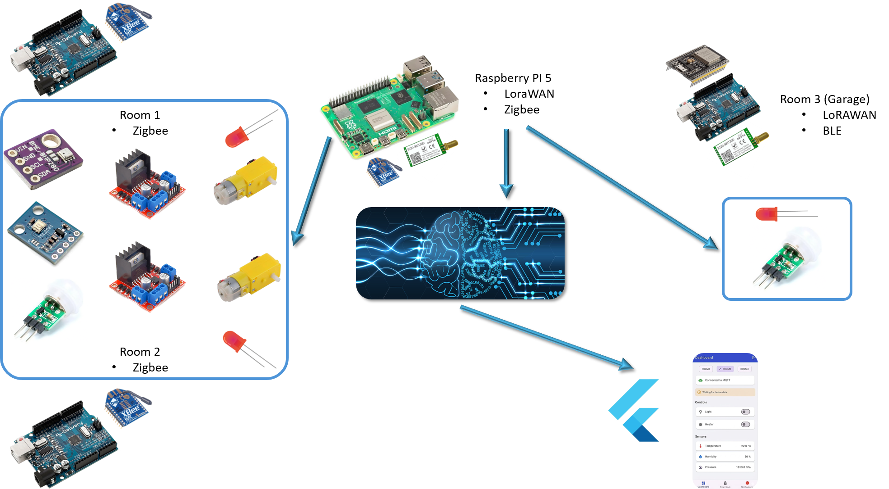
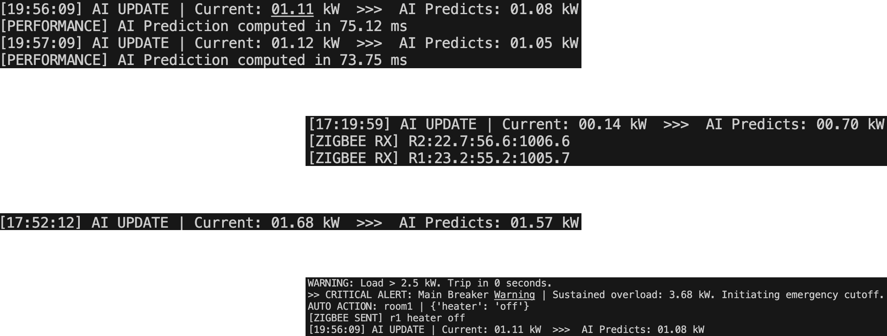

# Enhancing Home Energy Efficiency with Predictive Appliance Control

This project implements an integrated **Smart Home Energy Management System** that combines multi-protocol IoT networking with Deep Learning to proactively manage energy consumption.

The system uses a **Raspberry Pi 5 Gateway** to orchestrate communication between various edge nodes and runs a **Bi-LSTM neural network** to forecast energy loads and perform predictive load shedding.

---

## 🏗️ System Architecture

The project is divided into:
- A physical sensing layer  
- A communication bridge  
- An intelligence layer  

### Physical & Network Layout

- **Central Gateway**  
  A Raspberry Pi 5 coordinating all traffic via MQTT and executing AI inference.

- **Indoor Nodes (Rooms 1 & 2)**  
  Use Zigbee for mesh communication to transmit temperature, humidity, and light data.

- **Garage Node (Room 3)**  
  Uses LoRa (E220) for long-range connectivity and includes an ESP32 BLE smart lock for secure access.



This diagram shows the connection between the Raspberry Pi, Zigbee nodes, and the LoRa garage node.

---

## 🧠 AI & Predictive Engine

The core of the system's efficiency is its ability to **predict future energy usage**.

### The Bi-LSTM Model

- **Architecture**  
  A Bidirectional Long Short-Term Memory (Bi-LSTM) network that captures temporal dependencies from both past and future contexts within a 60-minute window.

- **Feature Set**  
  The model processes **21 distinct features**, including:
  - Appliance-specific loads (dishwasher, furnace, etc.)
  - Environmental telemetry
  - Cyclical time transforms (sine/cosine of hours/days)

- **Predictive Load Shedding**  
  When the model forecasts a spike that exceeds a predefined threshold, the gateway automatically sends commands to **shed (turn off)** non-essential loads like heaters or lights.



This graph illustrates the predicted load vs. actual load and the triggered load-shedding action.

---

## 📡 Communication Protocols

The system demonstrates a hybrid networking approach:

| Protocol | Location     | Purpose                    | Key Components                      |
|----------|--------------|----------------------------|-------------------------------------|
| Zigbee   | Rooms 1 & 2  | Indoor Mesh & Telemetry    | Xbee Modules, BME280, TSL2561        |
| LoRa     | Room 3       | Long-Range Connectivity    | EBYTE E220, QoS with ACK/Retry       |
| BLE      | Garage       | Secure Authentication      | ESP32, UUID-based Service            |
| MQTT     | Gateway      | Real-time Data Sync        | Paho-MQTT, Firebase Integration      |

---

## 🚀 Setup and Installation

### 1. Hardware Requirements

- Raspberry Pi 5 (Gateway)  
- Arduino Uno/Nano (Edge Nodes)  
- ESP32 (Smart Lock)  
- Xbee Modules (Zigbee)  
- EBYTE E220 (LoRa)  

---

### 2. Software Installation

Clone the repository and install dependencies:

```bash
pip install -r requirements.txt

---

### 3. Configuration

- **Firebase**  
  Place your `service_account.json` in the root directory  
  *(Ensure it is listed in `.gitignore`)*

- **Serial Ports**  
  Update `config.py` with the correct paths:
  - Zigbee → `/dev/ttyUSB0`
  - LoRa → `/dev/ttyUSB1`

---

### 4. Running the System

```bash
python3 gateway_smart_home.py
